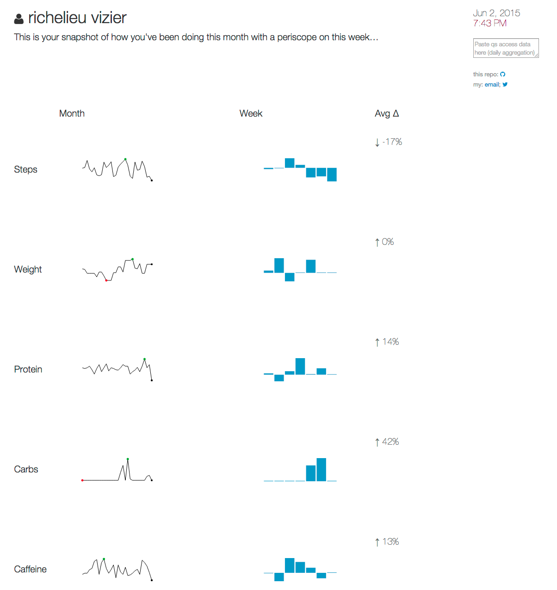
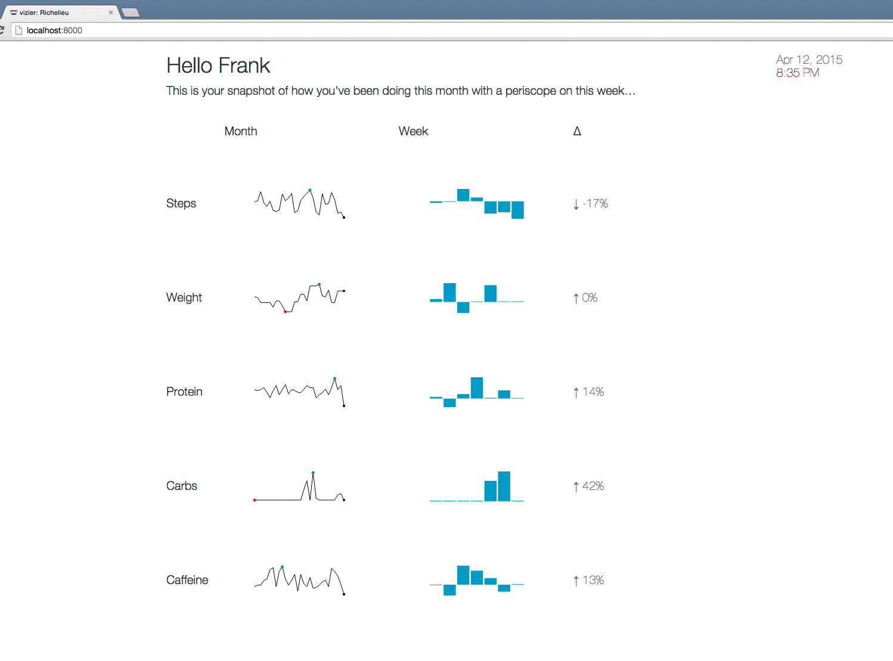
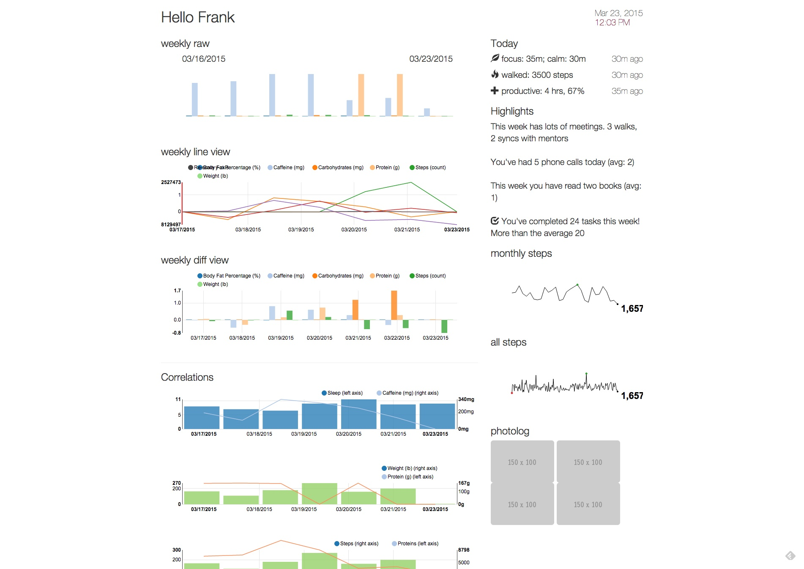
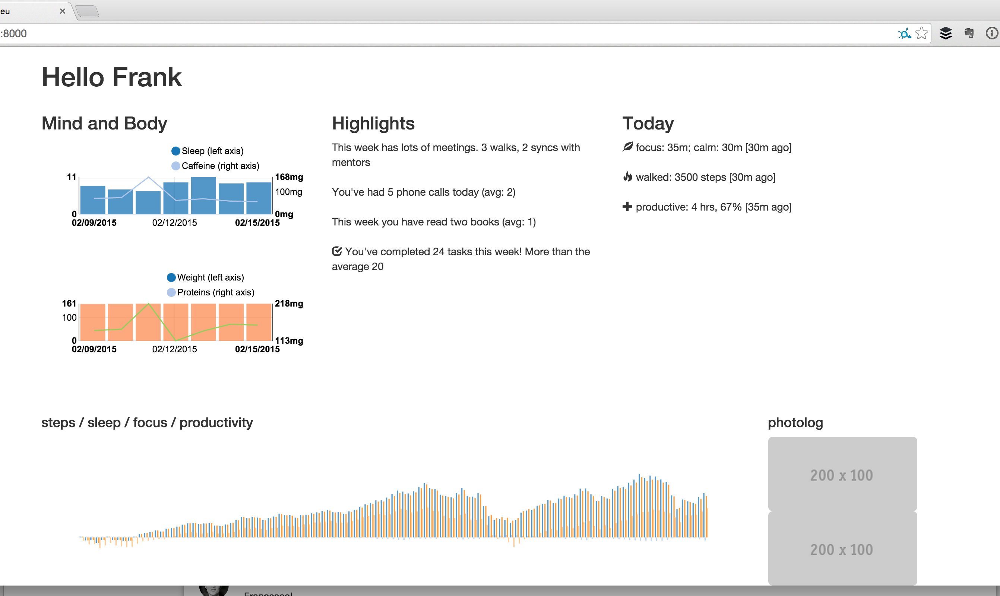

# Tracking

## todo

- Async service for three way binding. Firebase? PouchDB?
- Beef up ransformation service / d3 convenience axis service
- Spark lines instead of bar + spark http://nvd3.org/livecode/index.html#codemirrorNav
- Use UI Router
- https://material.angularjs.org/#/layout/container

## done

Mar 6, 2015: Created basic data transformation service to fetch / clean. Import a csv into data-service.js with private data from QS Access
Feb 15, 2015: Basic framework and data flow work from services, controllers directives. Seed: Angular / Require / nvd3 / bootstrap bower
Feb 13, 2015: Data cleaning for health data set

## screens

- 2015, June 2
  
- 2015, April 12
  
- 2015, March 23
  
- 2015, February 20
  
