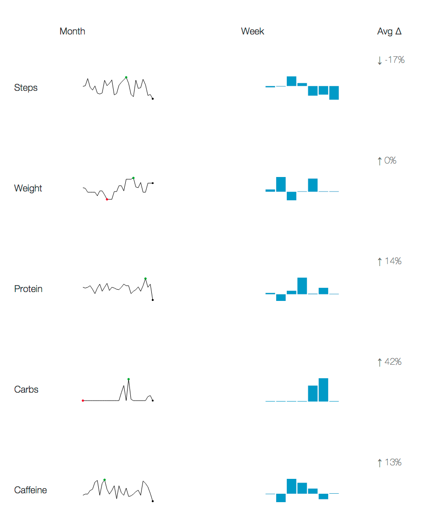
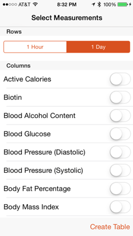

# richelieu vzier

[Demo](https://vzier.github.io/richelieu/)

| About | Screenshot |
| --------- | ------------- |
| This is a tool for creating feedback loops from [HealthKit](https://www.apple.com/ios/whats-new/health/) data (leveraging [QS Access](http://quantifiedself.com/access-app/app)). It could be displayed as a home page or dashboard. It offers a view for steps, weight, protein, carbs and caffeine.  Awareness (i.e. understanding activity) is a first principle of creating change. I frequently run experiments and found feedback (loops) to be critical. Research has shown views of the past week are useful to reflect upon change, hence this tool focuses on the past week. |  |

## Use

| QS Access | Steps |
| --------- | ------------- |
|1. Track steps, weight, protein, carbs, and caffeine via HealthKit  2. Export using [QS Access](http://quantifiedself.com/access-app/app).  The metrics I use are: **Caffeine, Carbohydrates, Protein, Steps, Weight**.  Aggregate upon a day e.g. see the right  3. Email / airdrop the csv to your computer  4. Paste the text of "Health Data.csv" into the input text box on [home page](https://vzier.github.io/richelieu/)| |

This application does not store any information on a server. All of your health data stays local on your browser (on local storage). Each time you open the application, it retrieves information from your last session. Your browser's LocalStorage are kind of like cookies. You can clear them at any time!

## Acknowledgements

Why the name?

> **A vizier** (/vɪˈzɪər/, rarely /ˈvɪzjər/; وزير‎ in Arabic script (Arabic, Persian and Urdu); Hindi: वज़ीर; sometimes spelled vazir, vizir, vasir, wazir, vesir, or vezir) is a high-ranking political advisor or minister. [<https://en.wikipedia.org/wiki/Vizier>]

Cardinal Richelieu

> The **Cardinal de Richelieu** was often known by the title of the King's "Chief Minister" or "First Minister". He sought to consolidate royal power and crush domestic factions. By restraining the power of the nobility, he transformed France into a strong, centralized state. [<https://en.wikipedia.org/wiki/Cardinal_Richelieu>]

- Data
  - QS Access <http://quantifiedself.com/access-app/app>
  - Spire <https://spire.io>
  - RescueTime <https://rescuetime.com>
- References / inspiration:
  - "angularjs-requirejs-d3-seed"
  - "angularjs-nvd3-directives"

